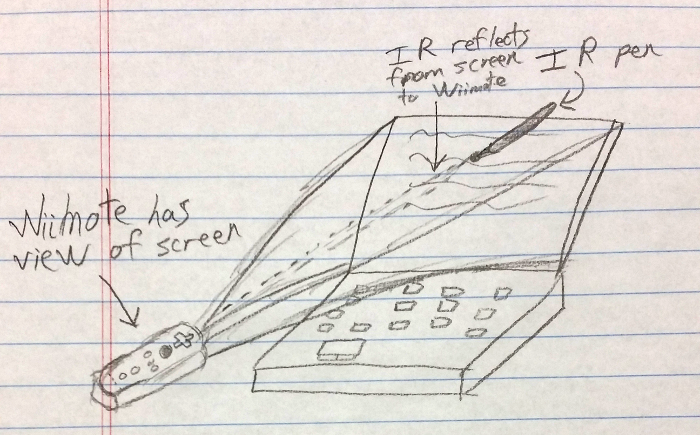

# WiiTouch

*Linux only*

*this is an old project (2012) and will almost undoubtedly require tweaking and programming smarts to get it working*

*this project may depend on old versions of dependencies, and could stand to be updated*

This program, together with a Wiimote and an infrared pen, can turn a computer screen into a touchscreen of sorts.  A "touch" is every time the Wiimote sees the light from the infrared pen.

The Wiimote communicates with the computer via Bluetooth.

## Physical Setup

## Requirements

 * [PyMouse](https://github.com/pepijndevos/PyMouse) - for controlling the computer's mouse
 * [Allegro](http://liballeg.org/) - for the calibration program, it would be better to use pygame instead
 * [cwiid](https://help.ubuntu.com/community/CWiiD) - for communicating with the Wiimote

Additionally, I recommend using [wmgui](http://linux.die.net/man/1/wmgui) for setting things up.

## Software Setup

 1. Install the requirements
 2. Build the calibrate app

## Running

Run WiiTouch.py or WiiTouch2.py.  The program first launches the calibrate app.  This sequentially displays a target in each corner of the screen.  Once a "touch" is recorded for this target, the next target is shown.  When a "touch" is recorded, WiiTouch knows the exact pixel coordinates of the target and the coordinates the Wiimote reports.  This allows it to calculate a transformation matrix to convert Wiimote coordinates to screen coordinates.

## Physical Setup

Set the Wiimote off to one corner, propped up and pointed at the screen.  Use wmgui to ensure the Wiimote can see the pens's reflection from every part of the screen.

## What to Expect

Don't expect this to be a nice, smooth interface!  A typical LCD screen is not totally reflective in the infrared spectrum.  This, combined with ambient light noise, means the Wiimote sometimes loses the LED.  In my experience the mouse movement is rather jerky.

## Tips for Success

 * Make sure there is no direct light shining on the screen
 * A dimly-lit room is more likely to work
 * Hold your hand so as not to get between the Wiimote and the screen

## Where can I Get an Infrared Pen?

I gutted a normal pen and put an infrared LED, battery, and resistor inside it.  I also attached a switch to turn the LED on and off.
